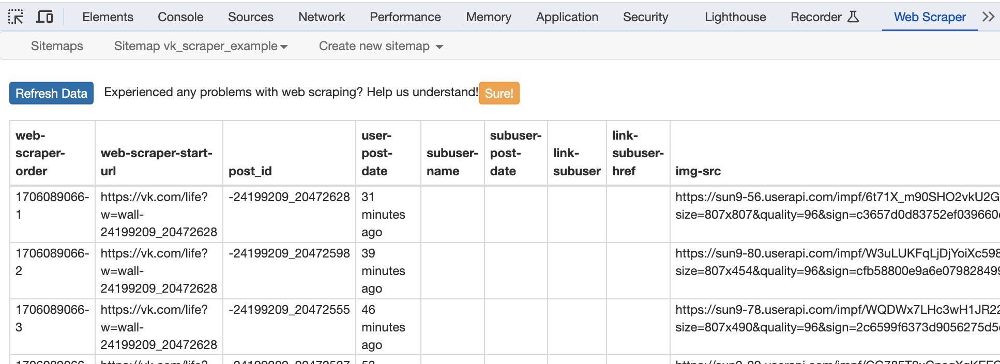

# VK-scraper
_VK-scraper_ is a tool designed to scrape valuable information from VK public channels. It extracts post details, including post ID, link, user, subuser (if reposted), post dates, post content, links in the post, reactions, and comments.

## Introduction

The goal of VK-scraper is to provide a convenient way to collect data from VK public channel posts, extracting essential information such as post content, publication date, subuser details in case of resharing, reactions, and comments. This tool is particularly useful for text analysis, sentiment analysis, and more. For this solution, the scraping pipeline is divided into two parts: collecting links, IDs, and dates to posts with WebScraper io, and obtaining the remaining data with Python.

## Installation

### Webscraper io Extension

To obtain links to posts, along with intermediate information such as post IDs and dates, you need to install the `Webscraper io` extension in your favorite web browser. I used Google Chrome. More information on WebScraper io is available [here](https://webscraper.io/how-to-video/create-a-sitemap).

### Python Libraries

Clone the VK-scraper Git repository; the master branch is sufficient.

```python
git clone https://github.com/DaliaO15/VK-scraper.git
cd vk_scraping
```

To run the scraper, Python libraries are required. Use the provided requirements file to install these libraries in your environment:

```bash
conda env create -f environment.yml
```

Make sure that Chromedriver is installed and running. If you need information on setting up Chromedriver, you can find it [here](https://developer.chrome.com/docs/chromedriver/get-started).

> For my environment, I used conda and Python version 3.10.

## Usage

### Get the Post IDs

After installing the extension, import the following sitemap:

```
{"_id":"SITEMAP_NAME","startUrl":["START_VK_POST_URL"],"selectors":[{"clickActionType":"real","clickElementSelector":"div#wk_right_arrow","clickElementUniquenessType":"uniqueText","clickType":"clickMore","delay":2000,"discardInitialElements":"do-not-discard","id":"click","multiple":true,"parentSelectors":["_root"],"selector":"div#wk_layer","type":"SelectorElementClick"},{"extractAttribute":"data-post-id","id":"post_id","multiple":false,"parentSelectors":["click"],"selector":"div.wl_post","type":"SelectorElementAttribute"},{"id":"user-post-date","multiple":false,"parentSelectors":["click"],"regex":"","selector":"button.vkuiLink","type":"SelectorText"},{"id":"subuser-name","multiple":false,"parentSelectors":["click"],"regex":"","selector":"a.CopyPost__authorLink","type":"SelectorText"},{"id":"link-subuser","linkType":"linkFromHref","multiple":false,"parentSelectors":["click"],"selector":"a.vkitInteractiveWrapper__root--TuhPN","type":"SelectorLink"},{"id":"img","multiple":false,"parentSelectors":["click"],"selector":"img.vkitImageSingle__image--wgSJ5","type":"SelectorImage"},{"id":"link","linkType":"linkFromHref","multiple":false,"parentSelectors":["click"],"selector":".wall_post_text a","type":"SelectorLink"},{"id":"likes","multiple":false,"parentSelectors":["click"],"regex":"","selector":"div.ReactionsPreview__count","type":"SelectorText"},{"id":"post_content","multiple":false,"parentSelectors":["click"],"regex":"","selector":"div.vkitShowMoreText__text--ULCyL","type":"SelectorText"}]}
```

You may want to modify the `startUrl` to the first post of the date from which you want to extract data. Here's how the automation works:

1. You set the starting point (`startUrl`). 
> The `startUrl` can also be modified in `edit metadata`
2. The scraper collects post IDs, dates, user names, and subuser names.
3. The scraper automatically clicks the "next button" and navigates to the next post.
4. Steps 2 and 3 repeat until you manually stop the scraper by closing the floating window for posts.

Once the scraper has completed its task, export the data to an .xlsx file.

> Note that you need to input the site name (id) and start_url in the site map above. 

### Scrape the Post Content and Comments

To retrieve the remaining data, you'll need the .xlsx file obtained in the last step, as it contains the post IDs. Use the script `data_collection.py` as follows:

```python
python data_collection.py --user A_VK_USER_NAME --input-file PATH/TO/INPUT/FILE/test.xlsx --output_folder_path PATH/TO/OUTPUT/FOLDER/ 
```

## Example

To demonstrate how to use VK-scraper, let's walk through a simple example.

### Step 1: Set the Starting Point (Web Scraper io)

Modify the `startUrl` in the configuration to the link of the first post from which you want to extract data.

```json
{"_id": "vk_scraping_examlpe",
"startUrl": ["https://vk.com/life?w=wall-24199209_20472628"],
//.....}
```
### Step 2: Scrape and Export (Web Scraper io)

After running the scraper and manually stopping it, you will see a table similar to the following:



Export this data to an .xlsx file.

### Step 3: Scrape and Export Again (Python)

Once the scraper has completed its task, and you have an .xlsx file containing post IDs, use the `data_collection.py` script to gather additional data.

```bash
python data_collection.py -u life -i ../../../Data/life/2021/life_Nov2021.xlsx -o ../../../Data/life/2021_final/
```
After you exceute the line of code above, you will get the follogin result:


## Additional information

### Notes and recommendations 

- **Memory Crash Caution:** There may be instances of memory crashes while retrieving links with WebDriver io. To prevent this, consider manually pausing the process at regular intervals.

- **Parallel Scraping with WebScraper io:** If you're aiming to collect a substantial number of links using WebScraper io, I recommend implementing parallel scraping. Achieve this by creating distinct user profiles in your web browser, installing the extension, and creating a separate sitemap (import) for each profile.

### Current Limitations

- The Web Scraper needs to be stopped manually as it crashes when it runs out of memory.
- Scraping private accounts is not supported.
- Error handling and logging capabilities are limited.

### Motivation for Design/Architecture Decisions

I opted for a hybrid method in designing this solution, considering it was intended for someone with limited knowledge in scraping and Python. Additionally, hardware limitations needed careful consideration. The goal was to create a solution that could be implemented on an average computer without relying on big data approaches, parallel computing, error recovery mechanisms, and more.

## License

- Refer to the `LICENSE` file for details on the license.
- The authors of this code not accept any responsibility for the misuse of it.
- This project was conducted under certified ethical approval.
